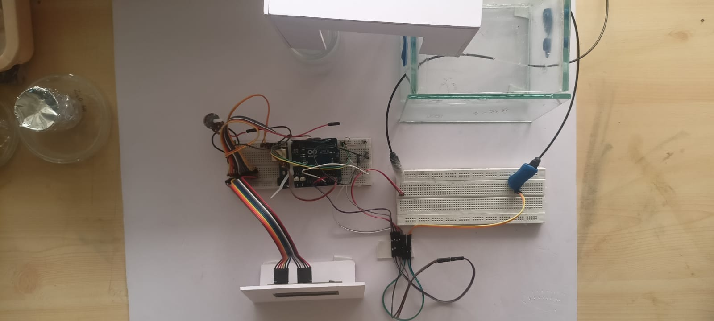
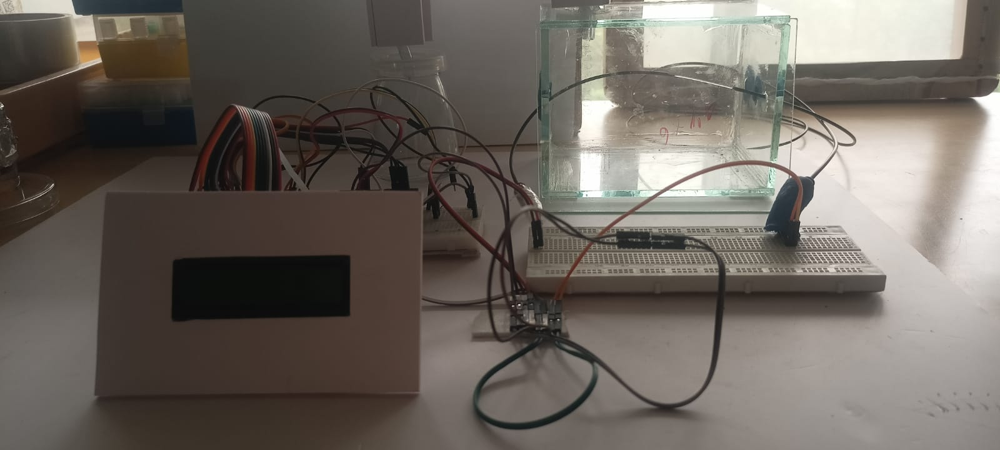
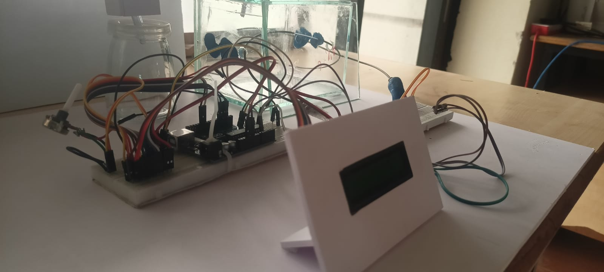

# Fiber Optic VOC Sensor

## Overview

This project presents a **low-cost Fiber Optic Volatile Organic Compound (VOC) Sensor** developed using **Arduino UNO**, an **LDR (Light Dependent Resistor)**, **Optical Fiber**, and a **16×2 LCD Display**. The system detects changes in light intensity transmitted through an optical fiber when exposed to volatile organic compounds (VOCs) such as **Ethanol** and **Acetone**.

An LED transmits light through the optical fiber to an LDR placed at the receiving end. Exposure to VOC gases changes the optical properties of the sensing region, altering the amount of light received by the LDR. The Arduino measures the resulting voltage using its Analog-to-Digital Converter (ADC), calculates the LDR resistance using the voltage divider principle, and displays the measured value on the LCD.

This project demonstrates a simple and affordable approach to VOC sensing for environmental monitoring and educational applications.

---

## Features

- Fiber optic-based VOC sensing
- Detection of Ethanol and Acetone samples
- Light intensity measurement using an LDR
- Resistance calculation using Arduino ADC
- Real-time display on a 16×2 LCD
- Portable and low-cost prototype
- Easy to build using readily available components

---

## Hardware Used

- Arduino UNO
- Optical Fiber
- LDR (Light Dependent Resistor)
- LED Light Source
- 16×2 LCD Display
- 470Ω Reference Resistor
- Breadboard
- Jumper Wires
- Power Supply

---

## Software Used

- Arduino IDE
- Embedded C

---

## Working Principle

1. An LED transmits light through the optical fiber.
2. The sensing region of the optical fiber is exposed to VOC gases.
3. VOC gases alter the transmitted light intensity.
4. The LDR detects the change in received light.
5. Arduino reads the LDR voltage using its ADC.
6. The LDR resistance is calculated using the voltage divider equation.
7. The calculated resistance is displayed on the 16×2 LCD.
8. Different VOC samples produce different resistance values, enabling gas detection.

---

## Formula Used

The LDR resistance is calculated using the voltage divider equation:

```
R₁ = R₂ × ((Vin / Vout) − 1)
```

Where:

- **R₁** = LDR Resistance
- **R₂** = 470Ω Reference Resistor
- **Vin** = 5V Supply Voltage
- **Vout** = Measured Output Voltage

---

## Hardware Block Diagram

```
LED Light Source
        │
        ▼
 Optical Fiber
        │
        ▼
 VOC Sensing Region
        │
        ▼
   LDR Receiver
        │
        ▼
   Arduino UNO
        │
        ▼
   16×2 LCD Display
```

---

## Applications

- Air Quality Monitoring
- Environmental Monitoring
- Industrial Safety
- Chemical Laboratories
- Smart Sensor Systems
- Educational Projects
- Research Applications

---

## Project Files

```
Fiber-Optic-VOC-Sensor/
│── voc_sensor.ino
│── README.md
│── Top_View.jpg
│── Front_View.jpg
│── Side_View.jpg
│── Ethanol_Test_Sample.jpg
│── Acetone_Test_Sample.jpg
```

---

## Skills Demonstrated

- Embedded C Programming
- Arduino Programming
- Analog-to-Digital Conversion (ADC)
- Optical Fiber Sensing
- Sensor Interfacing
- LCD Interfacing
- Voltage Divider Circuit Design
- Embedded Hardware Prototyping
- Electronics Testing

---

## Future Improvements

- ESP32-based IoT Monitoring
- Cloud Data Logging
- Mobile Application Integration
- Wireless Monitoring
- OLED/TFT Display
- Multiple VOC Detection
- Real-Time Graph Visualization

---

# Project Images

## Top View



*Top view of the Fiber Optic VOC Sensor prototype.*

---

## Front View



*Front view of the complete hardware setup.*

---

## Side View



*Side view showing the optical fiber sensing arrangement.*

---

## Ethanol Test Sample


*Sensor response while testing with an Ethanol sample.*

---

## Acetone Test Sample


*Sensor response while testing with an Acetone sample.*

---

## Author

**Ravichandran C S**

📧 Email: ravichandrancs123@gmail.com

🔗 GitHub: https://github.com/Ravi-eng17

💼 LinkedIn: https://linkedin.com/in/ravi-chandran-cs-3923811b3

---

## License

This project is shared for educational and learning purposes. Feel free to use and modify it with appropriate attribution.
